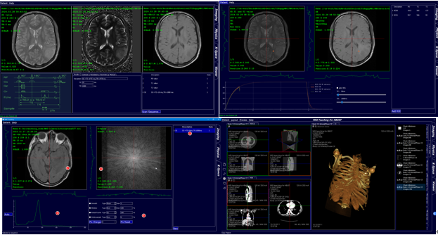

# 0,description

A MRI simulation software for teaching, especially for undergraduates or beginners

1. **Easy to learn and use**: For beginners, magnetic resonance simulation software should have a clear user interface and easy-to-understand operation process. This can help them grasp the use of the software faster.

2. **Visualization function**: A good simulation software should have powerful visualization functions, which can present complex magnetic field distributions, resonance processes, etc. to users in an intuitive way, helping them better understand and grasp magnetic resonance knowledge.

3. **Rich teaching resources**: In addition to the software itself, rich teaching resources such as tutorials, cases, and experimental guidance should be provided to help learners better grasp magnetic resonance knowledge.

# 1,develop
- Qt 5.12.2
- VS2015
- opencv-2.4.9
- dcmtk-3.6.3
- vtk8.2
- vtkdicom

# 2,licence
- LGPL

# 3,Thanks
- Asclepios-DICOM-Viewer   MIT License
https://github.com/GavriloviciEduard/Asclepios-DICOM-Viewer

- VTK BSD license.
https://vtk.org/about/#license

- DCMTK 
https://dicom.offis.de/download/dcmtk/dcmtk368/COPYRIGHT

- vtk-dicom
https://github.com/dgobbi/vtk-dicom/blob/master/Copyright.txt

- OpenCV
https://github.com/opencv/opencv/blob/4.4.0/LICENSE

- Qt
https://www.qt.io/

- mrisim
https://www.mrisim.org/manual.php

- K-space Explorer
https://github.com/birogeri/kspace-explorer

- desktop-MRI
https://github.com/ritvd/desktop-MRI

- MRiLab
https://github.com/leoliuf/MRiLab

# 4,contact
- 1712761554@qq.com
- any file missing, problem of develop env., Please contact me.

